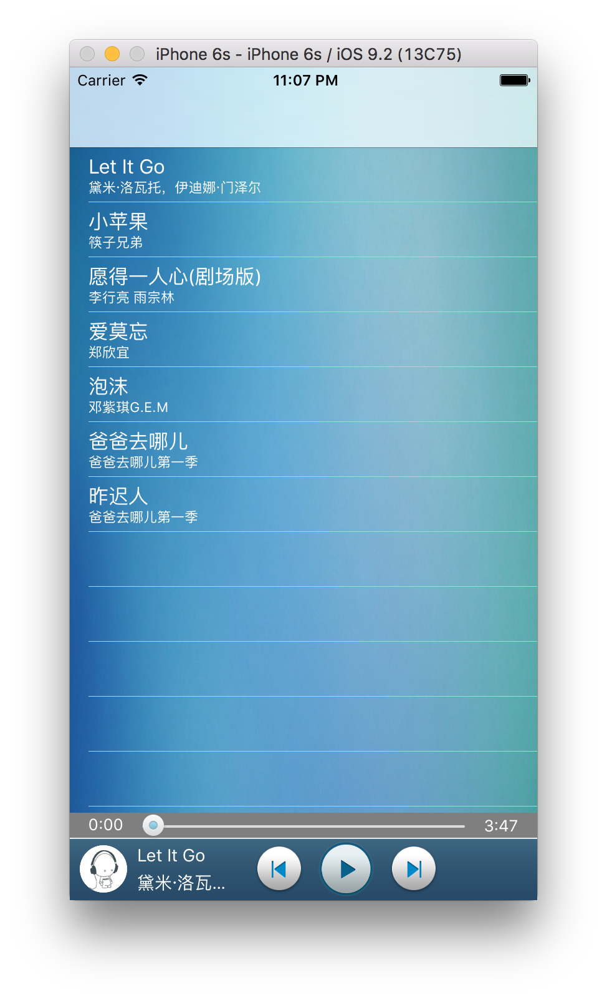
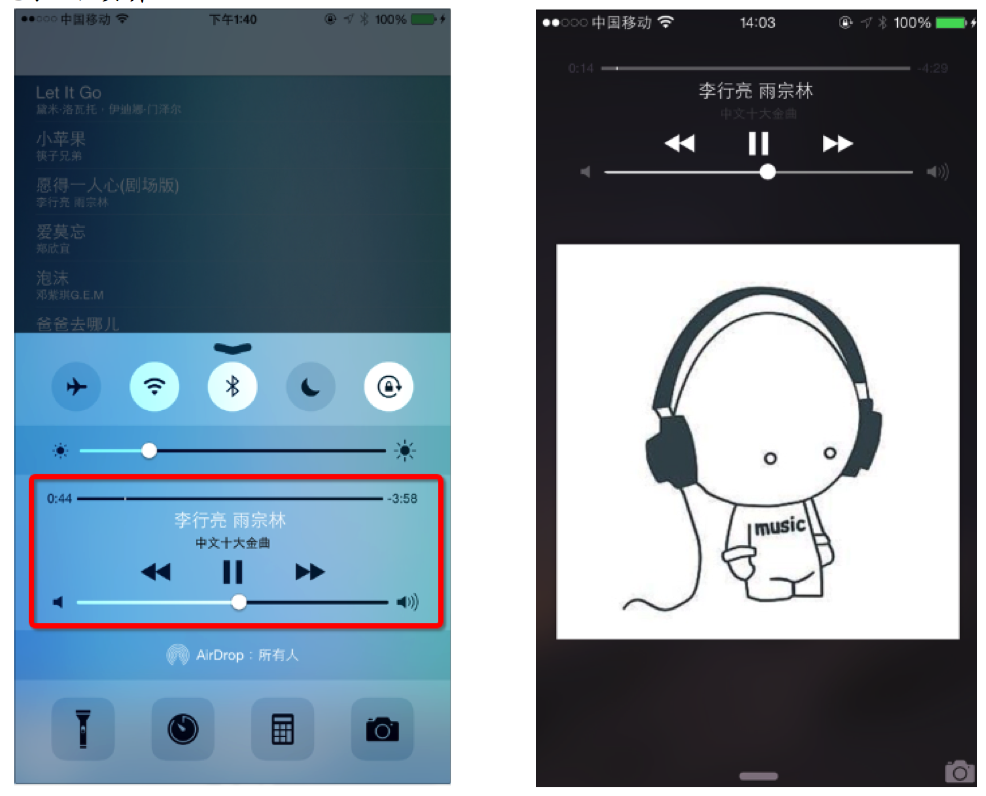

# 说明文档——音乐播放器
## 排版与歌曲列表的显示

## 播放工具条中的显示
* 歌手图片为圆形的UIImageView
* 专辑图片会在播放时旋转

## 播放工具条中的控制

* 通过代理通知控制器
* 创建音乐工具类(单例)控制音乐的播放与暂停
* 实现上一首与下一首的循环播放

## Slider的显示与控制

* Slider监听touchDown、touchUp、valueChange三个事件
* 实时更新播放位置，拖拽控制音乐播放位置

## 设置音乐后台播放

1. 在didFinishLaunching方法激活音频的会话类型即可，代码如下

        AVAudioSession *session = [AVAudioSession sharedInstance]; 
        [session setCategory:AVAudioSessionCategoryPlayback error:nil];
        [session setActive:YES error:nil];
        
2. 在applicationDidEnterBackground方法开始后台任务，代码如下

        [application beginBackgroundTaskWithExpirationHandler:nil];
        
3. 在info.plist中添加'Required background modes'选向，然后再添加'App plays audio or streams audio/video using AirPlay'

## 实现歌曲锁屏

* 设置锁屏的音乐信息要使用MediaPlayer框架的MPNowPlayingInfoCenter类来实现
* 代码设置锁屏时的播放信息代码为[MPNowPlayingInfoCenter defaultCenter].nowPlayingInfo,nowPlayingInfo传入一个字典

    - MPMediaItemPropertyAlbumTitle:专辑名称
    - MPMediaItemPropertyTitle:歌曲
    - MPMediaItemPropertyArtist:作者
    - MPMediaItemPropertyArtwork:专辑图片，需要传入一个MPMediaItemArtwork对象
    - MPMediaItemPropertyPlaybackDuration:时间
* 在didFinishLaunching添加接收远程事件代码,"一定要添加，不然无效果"

        [application beginReceivingRemoteControlEvents];

## 实现锁屏按钮远程事件

* 在appdelegate中实现remoteControlReceivedWithEvent，来接收远程事件
* 利用block接收不同的远程事件类型