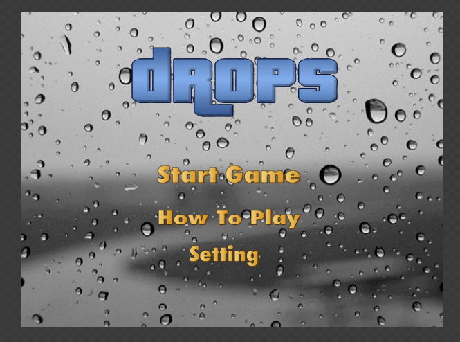
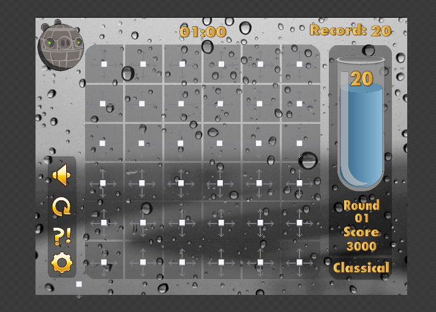
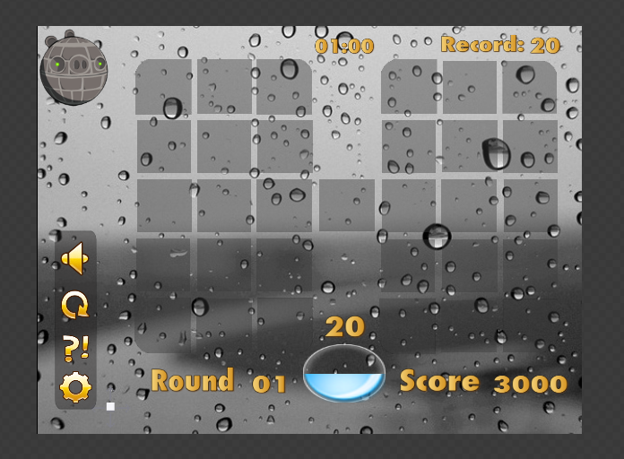
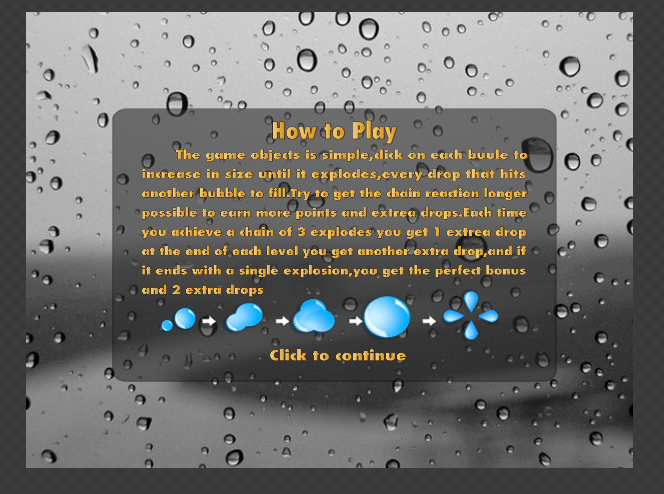
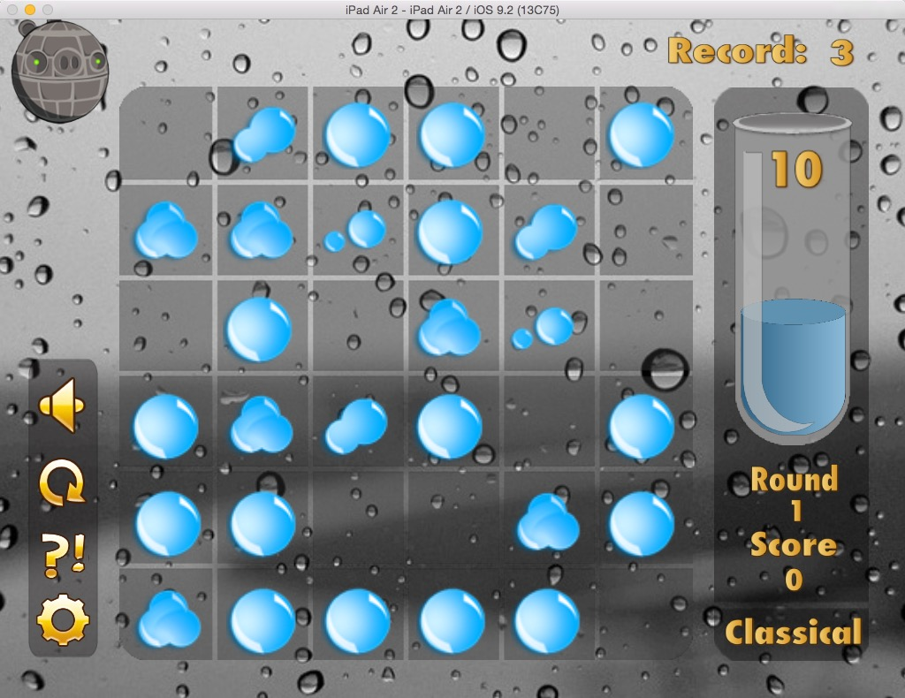

##开发者

- 谭锦志 （apanoo@126.com）
- 项目地址：https://github.com/apanoo/DropsGame

##游戏概况

- 基于cocos2d-x 3.9

- 发布平台：Android、iOS9

##游戏规则

- 初始状态玩家拥有10滴水滴

- 填补游戏区水滴直至水滴爆炸，获得连锁反应

- 所有水滴均消去则获胜

- 未能消去所有所有水滴则失败

##设计效果

- 开始界面设计效果

- 经典模式界面设计效果

- 极限模式界面设计效果

- 帮助界面设计效果

##开发进度

- 游戏框架及文件结构整理 （OK）

- 游戏素材编辑 （OK）

- 游戏素材加载 （OK）

- 模块划分整理 （OK）

- UI动画实现   （OK）

- 游戏网格参数化（OK）

- 游戏逻辑实现 （OK）

- 关卡管理    （OK）

- 关卡优化    （OK）

- Classical mode 完成  （OK）

##运行截图

